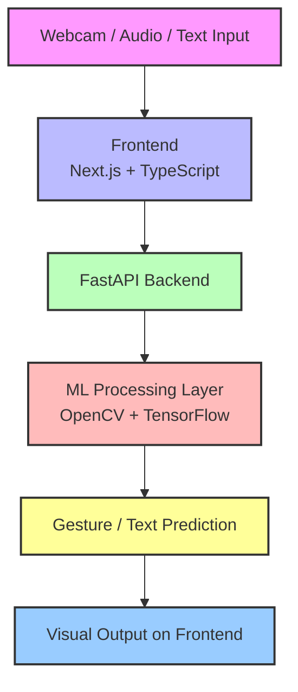
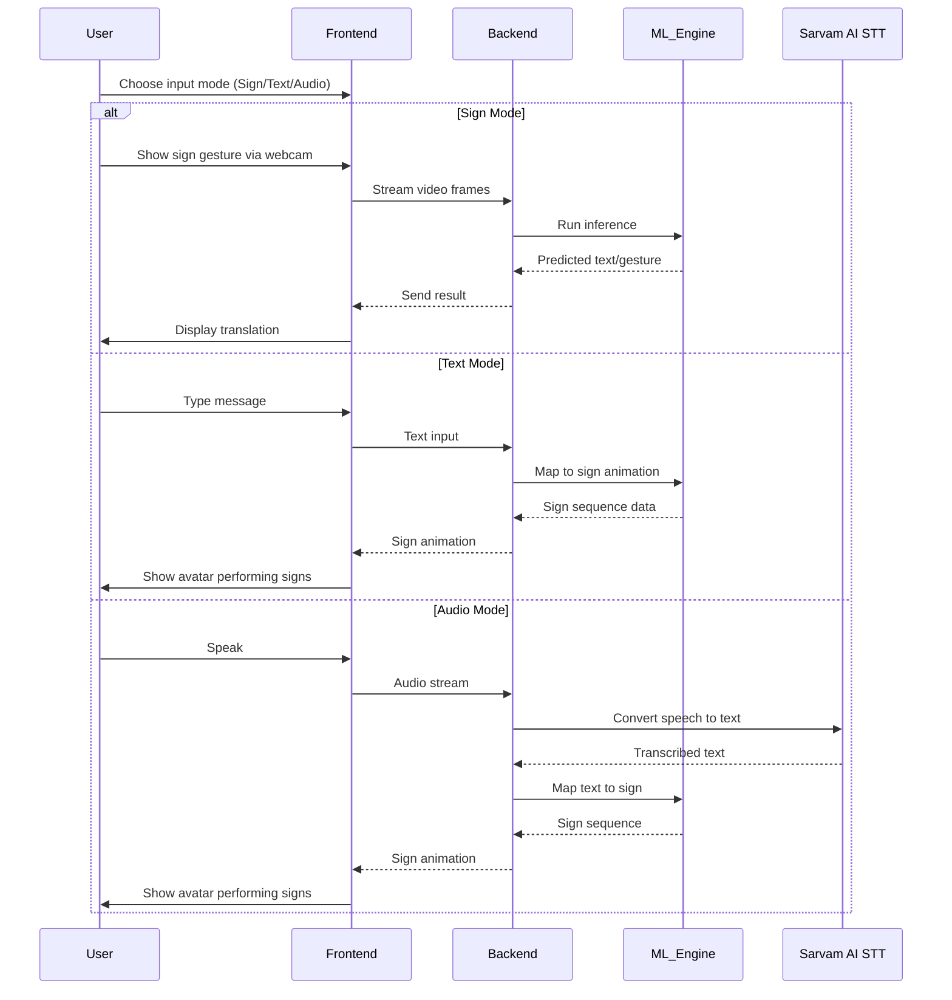

# AURA 🤟

### AI-Powered Multi-Modal Sign Language Communication System

<p align="center">
  
  
  
</p>

---

##  Table of Contents

- [The Problem](#the-problem)
- [Our Solution](#our-solution)
- [Key Features](#key-features)
- [System Architecture](#system-architecture)
- [How It Works](#how-it-works)
- [Tech Stack](#tech-stack)
- [Getting Started](#getting-started)
  - [Prerequisites](#prerequisites)
  - [Backend Setup](#backend-setup)
  - [Frontend Setup](#frontend-setup)
- [Team](#team)
- [Vision](#vision)
---

## The Problem

Communication between **sign language users and non-signers** remains a significant barrier.

Most existing systems only address **one side** of the conversation:

- Sign ➜ Text  
- Text ➜ Sign  

But **real conversations** require **two-way communication**—and sometimes even **three ways** (sign, text, and speech).

---

## Our Solution

We built **AURA**, a **multi-modal communication system** that seamlessly connects:

**Sign Language**  
**Text**  
**Speech**

AURA allows users to communicate through **three different input modes**:

- Sign ➜ Text  
- Text ➜ Sign  
- Audio ➜ Sign  

Instead of forcing people to adapt to technology,  
**AURA adapts to the way humans naturally communicate.**

---

## Key Features

- Real-time **Sign Language Detection** using computer vision.
- **Speech-to-Sign** translation via Sarvam AI STT.
- **Text-to-Sign** mapping with a dynamic gesture library.
- Interactive **web interface** built with Next.js.
- Real-time **video processing pipeline** with OpenCV and TensorFlow.

---

## System Architecture

AURA follows a **full-stack AI architecture** with clear separation of concerns:



### Data Flow Diagram



---

## How It Works

1. **Input Capture** – User selects input modality: webcam (sign), microphone (speech), or keyboard (text).
2. **Processing** – Data is sent to the FastAPI backend.
   - For video, OpenCV extracts frames and TensorFlow predicts gestures.
   - For audio, Sarvam AI STT converts speech to text.
   - For text, it's directly passed to the mapping module.
3. **Translation** – Gestures are mapped to text; text is mapped to sign animations.
4. **Output** – Results are displayed in the frontend: either as text or as an avatar performing sign language.

---

## Tech Stack

| Category       | Technologies                                                                 |
|----------------|------------------------------------------------------------------------------|
| **Machine Learning** | TensorFlow / Keras, OpenCV, NumPy                                            |
| **Backend**    | FastAPI, Uvicorn ASGI Server, Python                                         |
| **Frontend**   | Next.js, React, TypeScript, TailwindCSS, Radix UI                            |
| **AI Services**| Sarvam AI Speech-to-Text (`saaras:v3`)                                       |
| **DevOps**     | Docker (optional), Git, npm, pip                                             |

---

## Getting Started

### Prerequisites

- Python 3.9+
- Node.js 18+
- npm or yarn
- Webcam (for sign detection)
- Microphone (optional, for speech input)

### Backend Setup

1. Clone the repository:
   ```bash
   git clone https://github.com/yourusername/aura.git
   cd aura/Backend
   ```

2. Create and activate a virtual environment:
   ```bash
   python -m venv venv
   source venv/bin/activate  # On Windows: venv\Scripts\activate
   ```

3. Install dependencies:
   ```bash
   pip install -r requirements.txt
   ```

4. Start the backend server:
   ```bash
   python main.py
   ```

   Backend will be available at `http://localhost:8000`.

### Frontend Setup

1. Open a new terminal and navigate to the frontend directory:
   ```bash
   cd ../Frontend
   ```

2. Install dependencies:
   ```bash
   npm install
   # or
   yarn install
   ```

3. Run the development server:
   ```bash
   npm run dev
   # or
   yarn dev
   ```

   Frontend will be available at `http://localhost:3000`.

---

## Vision

AURA aims to make communication **inclusive**, **accessible**, and **intelligent** by bridging the gap between **spoken language and sign language** using cutting-edge AI.

We envision a world where no one is left out of a conversation because of a language barrier—whether spoken or signed.

---

##  Team

### Ann Maria Jaison
- Frontend
-  Machine learning
- Backend: Audio-to-Text Module, Sign-to-Text and Text-to-Sign Module
- Documentation
### Ashlin Joy Varghese
- Research
- Documentation
- Presentation
- Backend Development: Audio-to-Text Module

### Catherine Susan Rajesh
- Documentation
- Presentation
- Research
- Backend Development: Sign-to-Text and Text-to-Sign Module

### Neha Joshy
- Research
- Documentation
- Presentation
- Backend Development: Audio-to-Text Module

<p align="center">
  Made with ❤️ by the AURA Team
</p>
